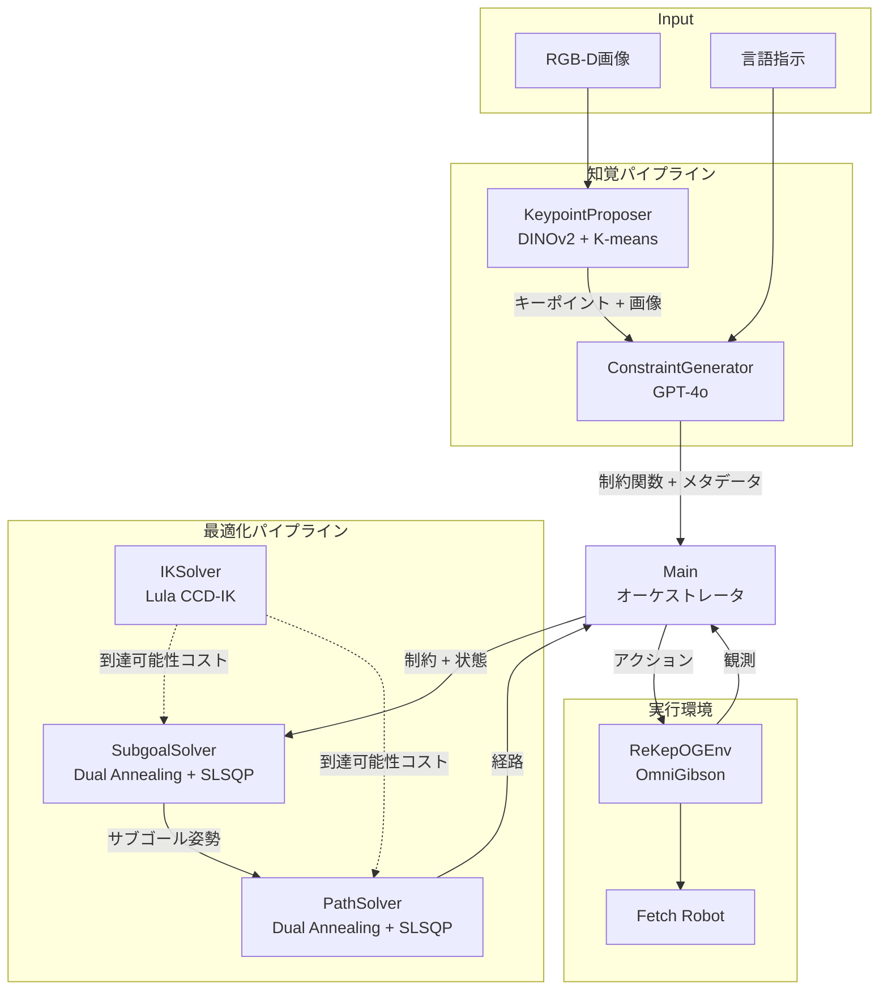
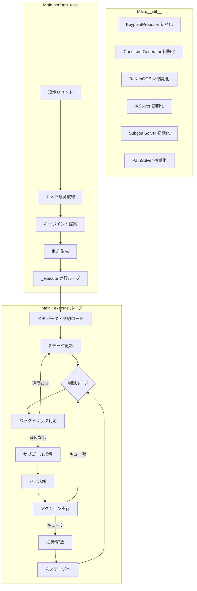
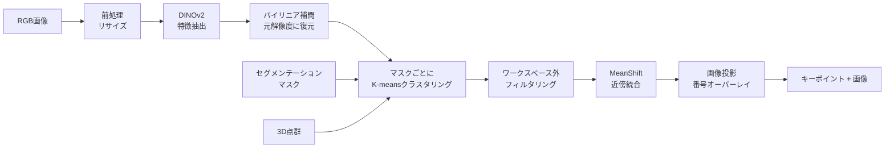
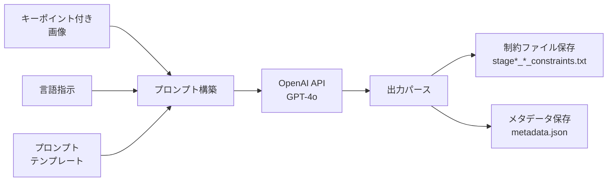
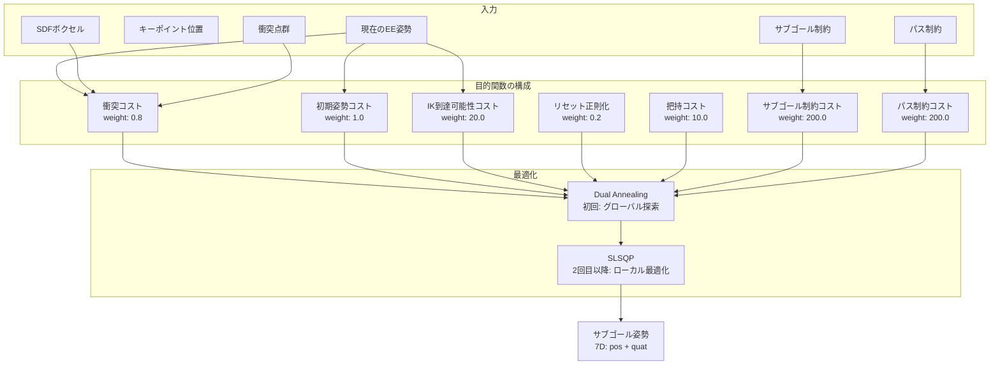
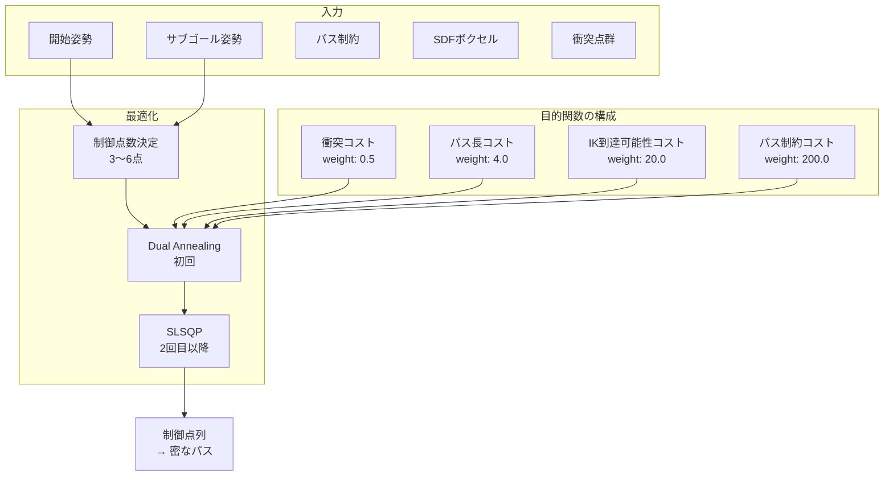
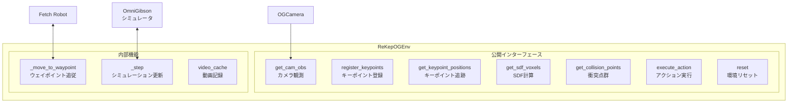
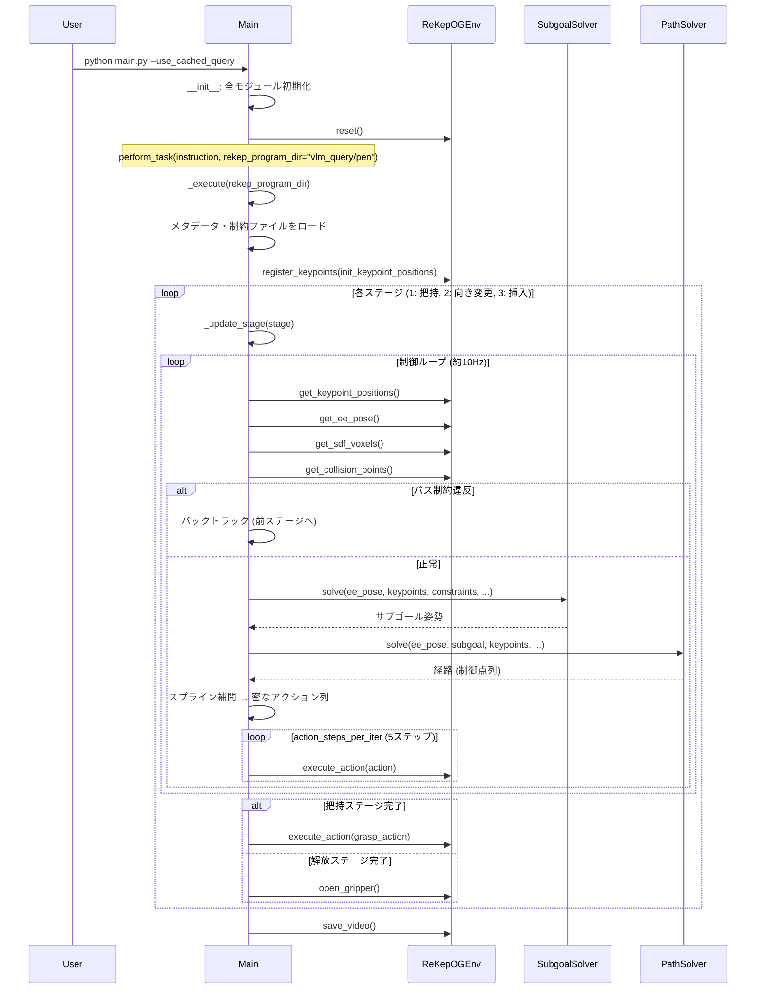
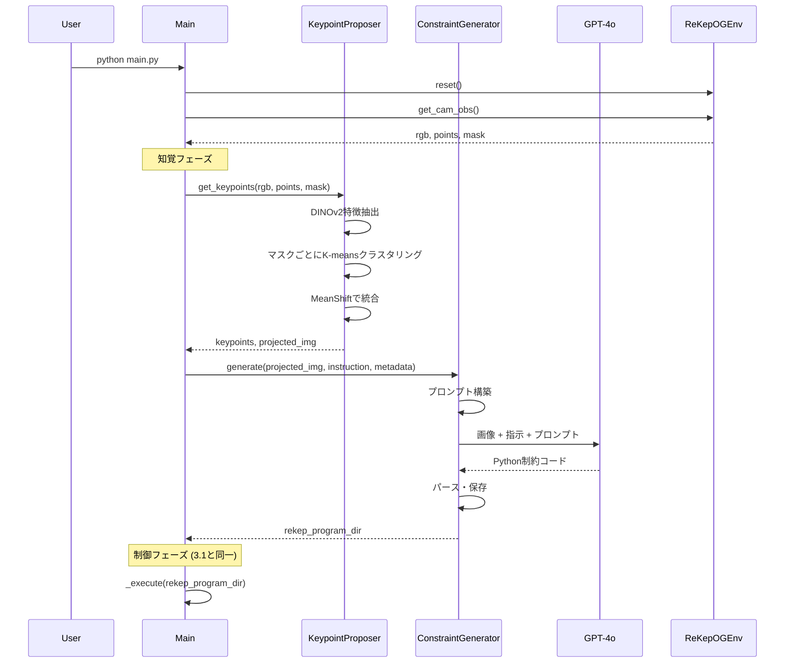
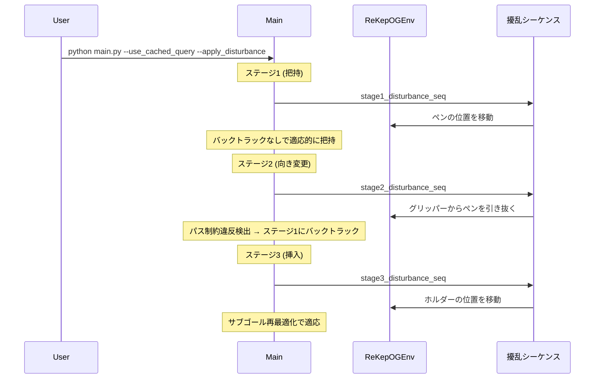

# ReKep: Spatio-Temporal Reasoning of Relational Keypoint Constraints for Robotic Manipulation

## 目次

- [1. 全体概要](#1-全体概要)
  - [1.1 概要](#11-概要)
  - [1.2 アーキテクチャ](#12-アーキテクチャ)
  - [1.3 各サブシステムの説明](#13-各サブシステムの説明)
- [2. サブシステム詳細](#2-サブシステム詳細)
  - [2.1 メインオーケストレータ (Main)](#21-メインオーケストレータ-main)
  - [2.2 キーポイント提案 (KeypointProposer)](#22-キーポイント提案-keypointproposer)
  - [2.3 制約生成 (ConstraintGenerator)](#23-制約生成-constraintgenerator)
  - [2.4 サブゴールソルバー (SubgoalSolver)](#24-サブゴールソルバー-subgoalsolver)
  - [2.5 パスソルバー (PathSolver)](#25-パスソルバー-pathsolver)
  - [2.6 IKソルバー (IKSolver)](#26-ikソルバー-iksolver)
  - [2.7 環境 (ReKepOGEnv)](#27-環境-rekepogenv)
  - [2.8 ビジュアライザ (Visualizer)](#28-ビジュアライザ-visualizer)
  - [2.9 ユーティリティ](#29-ユーティリティ)
- [3. ユースケース](#3-ユースケース)
  - [3.1 キャッシュ済みクエリによるデモ実行](#31-キャッシュ済みクエリによるデモ実行)
  - [3.2 ライブVLMクエリによる実行](#32-ライブvlmクエリによる実行)
  - [3.3 外部擾乱付きデモ実行](#33-外部擾乱付きデモ実行)

---

## 1. 全体概要

### 1.1 概要

ReKep (Relational Keypoint Constraints) は、大規模視覚モデル (LVM) と視覚言語モデル (VLM) を活用して、ロボットのマニピュレーションタスクを**キーポイント間の空間的・時間的制約**として表現し、それを階層的最適化で解くフレームワークである。

核となるアイデアは以下の通り:

1. **キーポイントベースのタスク表現**: タスクをシーン内の意味的に重要な3Dキーポイント間の関係（Python関数）として表現する。これにより、VLMが直接的にコード生成できる形式でタスクを記述できる
2. **ステージ分解**: マニピュレーションタスクを複数のステージ（把持、移動、配置など）に分解し、各ステージに対してサブゴール制約（ステージ終了時に満たすべき条件）とパス制約（ステージ中に常に満たすべき条件）を定義する
3. **階層的最適化**: 各制御ループで、まずサブゴール（次の到達すべきエンドエフェクタ姿勢）を求め、次にそこへの経路を求める2段階の最適化を行う
4. **閉ループ制御**: キーポイントの追跡とリアルタイム再最適化により、外部擾乱に対してロバストな制御を実現する

**設計の動機**: 従来手法ではタスクごとに制約を手動定義する必要があったが、ReKepではVLMによる自動生成を実現している。キーポイントの3D座標上での算術演算でタスクを表現するため、VLMが苦手な3D回転表現を回避しつつ、完全な SE(3) 制御を可能にしている。

### 1.2 アーキテクチャ



### 1.3 各サブシステムの説明

| サブシステム | ファイル | 役割 |
|---|---|---|
| メインオーケストレータ | [main.py](../main.py) | 全体の制御フロー管理、ステージ遷移、バックトラック |
| キーポイント提案 | [keypoint_proposal.py](../keypoint_proposal.py) | DINOv2特徴量を使ったシーンキーポイントの自動提案 |
| 制約生成 | [constraint_generation.py](../constraint_generation.py) | GPT-4oによるReKep制約関数の自動生成 |
| サブゴールソルバー | [subgoal_solver.py](../subgoal_solver.py) | 次のサブゴール姿勢の最適化 |
| パスソルバー | [path_solver.py](../path_solver.py) | サブゴールへの衝突回避経路の最適化 |
| IKソルバー | [ik_solver.py](../ik_solver.py) | 逆運動学による到達可能性評価 |
| 環境 | [environment.py](../environment.py) | OmniGibsonシミュレータとのインターフェース |
| ビジュアライザ | [visualizer.py](../visualizer.py) | 点群ベースの3D可視化 |
| 座標変換 | [transform_utils.py](../transform_utils.py) | クォータニオン・オイラー角・回転行列の変換 |
| ユーティリティ | [utils.py](../utils.py) | 最適化補助、補間、制約ロード等 |
| カメラ | [og_utils.py](../og_utils.py) | OmniGibsonカメラ管理、ピクセル⇔3D変換 |
| 設定 | [configs/config.yaml](../configs/config.yaml) | 全モジュールの設定パラメータ |

---

## 2. サブシステム詳細

### 2.1 メインオーケストレータ (Main)

**ファイル**: [main.py](../main.py)

#### 概要

`Main` クラスはReKepシステム全体のオーケストレータであり、以下を担う:
- 各サブシステムの初期化と統合
- タスクの2フェーズ実行（知覚→制御）
- ステージベースの実行ループとバックトラック機構

#### アーキテクチャ



#### 各コンポーネントの説明

**初期化** ([main.py#L24-L53](../main.py#L24-L53)):
- `KeypointProposer`, `ConstraintGenerator`, `ReKepOGEnv`, `IKSolver`, `SubgoalSolver`, `PathSolver` を設定ファイルに基づいて初期化
- IKSolverはFetchロボット専用で、到達可能性コストの計算に使用される
- **設計理由**: IKSolverをSubgoalSolverとPathSolverに注入することで、最適化中にIK実行可能性を評価し、到達不能なポーズを回避できる

**perform_task** ([main.py#L55-L73](../main.py#L55-L73)):
- エントリーポイント。`rekep_program_dir` が未指定ならキーポイント提案→制約生成を実行し、指定済みならキャッシュされた制約を使用する
- **設計理由**: キャッシュオプションにより、VLMクエリなしでの再現実行やデバッグが可能

**_execute** ([main.py#L80-L158](../main.py#L80-L158)):
- メインの制御ループ。以下を繰り返す:
  1. シーンキーポイントの現在位置を取得
  2. パス制約違反をチェックし、違反があればバックトラック
  3. サブゴールと経路を最適化
  4. `action_steps_per_iter` ステップ分のアクションを実行
  5. ステージ完了時は把持/解放を実行し、次ステージへ進む
- **設計理由**: バックトラック機構により、外部擾乱（物体を動かされる等）に対するロバスト性を確保。制御ループ内で毎回再最適化することで閉ループ制御を実現

**_get_next_subgoal** ([main.py#L160-L179](../main.py#L160-L179)):
- 現在のステージの制約を渡してSubgoalSolverを呼び出す
- 把持ステージの場合、把持深さの半分だけ後退したポーズを返す（把持動作の余地を確保）

**_get_next_path** ([main.py#L181-L197](../main.py#L181-L197)):
- サブゴールに向かう経路をPathSolverで最適化し、スプライン補間で密なパスに変換

**_update_stage** ([main.py#L218-L236](../main.py#L218-L236)):
- ステージの更新処理。把持/解放ステージのフラグ設定、グリッパー開閉、movableマスクの更新を行う
- **設計理由**: `keypoint_movable_mask` により、把持中の物体に紐づくキーポイントだけをエンドエフェクタと連動して動かせる。これは剛体仮定に基づく前方モデルの実装

---

### 2.2 キーポイント提案 (KeypointProposer)

**ファイル**: [keypoint_proposal.py](../keypoint_proposal.py)

#### 概要

シーンのRGB画像からDINOv2の特徴量を抽出し、意味的に重要な領域のキーポイントを自動提案する。VLMが理解しやすい視覚的マーカーとして画像上にオーバーレイされる。

#### アーキテクチャ



#### 各コンポーネントの説明

**初期化** ([keypoint_proposal.py#L9-L22](../keypoint_proposal.py#L9-L22)):
- DINOv2 (ViT-S/14) をロードし、MeanShiftクラスタリングを設定
- **設計理由**: DINOv2は自己教師あり学習により意味的に豊かなパッチ特徴量を提供し、タスク固有の学習なしで物体の部品レベルの理解が可能

**get_keypoints** ([keypoint_proposal.py#L24-L55](../keypoint_proposal.py#L24-L55)):
- メインのパイプライン:
  1. 前処理（パッチサイズ14に合わせたリサイズ）
  2. DINOv2特徴量抽出 + バイリニア補間で元解像度に復元
  3. 各セグメンテーションマスク内でPCA次元削減後、K-meansクラスタリング（k=5）
  4. ワークスペース範囲外の候補をフィルタリング
  5. MeanShiftで近接キーポイントを統合（閾値: `min_dist_bt_keypoints` = 0.06m）
  6. 画像上にキーポイント番号をオーバーレイ

**_get_features** ([keypoint_proposal.py#L84-L101](../keypoint_proposal.py#L84-L101)):
- DINOv2のパッチトークンを抽出し、バイリニア補間でピクセルレベルの特徴量に復元
- **設計理由**: パッチレベルの特徴量をピクセルレベルに補間することで、正確な3D座標へのマッピングが可能

**_cluster_features** ([keypoint_proposal.py#L103-L151](../keypoint_proposal.py#L103-L151)):
- 各マスク内でPCA（3次元）+ 3D座標を連結した6次元空間でK-meansクラスタリング
- **設計理由**: PCAでノイズやテクスチャの影響を低減しつつ、3D座標を追加することで空間的に分散した候補を得る。特徴空間と3D空間の両方を考慮することで、意味的にも幾何的にも重要なキーポイントを提案できる

---

### 2.3 制約生成 (ConstraintGenerator)

**ファイル**: [constraint_generation.py](../constraint_generation.py)

#### 概要

キーポイントがオーバーレイされた画像と言語指示をGPT-4oに入力し、ReKep制約関数（Python関数）を自動生成する。生成された関数は各ステージのサブゴール制約とパス制約に分類・保存される。

#### アーキテクチャ



#### 各コンポーネントの説明

**プロンプトテンプレート** ([vlm_query/prompt_template.txt](../vlm_query/prompt_template.txt)):
- VLMに対して制約関数の形式・規約を詳細に指示するテンプレート
- 以下を含む: ステージ分解の例、制約関数の入出力仕様、`grasp_keypoints`/`release_keypoints` の定義
- **設計理由**: VLMにPythonコードとしてキーポイント間の算術演算を書かせることで、3D回転のような複雑な幾何学的関係を自然に表現できる。VLMはコード生成に長けているため、この形式は高い信頼性でタスクの意味を捕捉できる

**generate** ([constraint_generation.py#L97-L132](../constraint_generation.py#L97-L132)):
- タスクディレクトリ作成 → 画像保存 → プロンプト構築 → OpenAI API呼び出し → 出力パース → 保存
- ストリーミングAPIを使用してリアルタイムに応答を取得

**_parse_and_save_constraints** ([constraint_generation.py#L49-L70](../constraint_generation.py#L49-L70)):
- VLM出力から `def` ブロックを抽出し、関数名のプレフィックス（例: `stage1_subgoal`）に基づいてファイルに分類・保存
- **設計理由**: 関数名の命名規則に基づく自動分類により、後段の制約ローダーとシームレスに連携

**_parse_other_metadata** ([constraint_generation.py#L72-L95](../constraint_generation.py#L72-L95)):
- VLM出力から `num_stages`, `grasp_keypoints`, `release_keypoints` を抽出
- これらはMain._executeでステージ管理と把持/解放の制御に使用される

**制約関数の例 (pen-in-holder タスク)**:

| ステージ | 制約種別 | ファイル | 内容 |
|---|---|---|---|
| 1: 把持 | サブゴール | [stage1_subgoal_constraints.txt](../vlm_query/pen/stage1_subgoal_constraints.txt) | エンドエフェクタをペンの把持点に合わせる |
| 2: 向き変更 | サブゴール | [stage2_subgoal_constraints.txt](../vlm_query/pen/stage2_subgoal_constraints.txt) | ペンをZ軸方向に直立させる |
| 2: 向き変更 | パス | [stage2_path_constraints.txt](../vlm_query/pen/stage2_path_constraints.txt) | ペンを把持し続ける |
| 3: 挿入 | サブゴール | [stage3_subgoal_constraints.txt](../vlm_query/pen/stage3_subgoal_constraints.txt) | ペンをホルダー上方20cmに配置 + 直立維持 |
| 3: 挿入 | パス | [stage3_path_constraints.txt](../vlm_query/pen/stage3_path_constraints.txt) | ペンを把持し続ける |

---

### 2.4 サブゴールソルバー (SubgoalSolver)

**ファイル**: [subgoal_solver.py](../subgoal_solver.py)

#### 概要

現在のエンドエフェクタ姿勢・キーポイント位置・制約関数を入力として、次のサブゴール（エンドエフェクタの目標SE(3)姿勢）を最適化により求める。

#### アーキテクチャ



#### 各コンポーネントの説明

**目的関数 (objective)** ([subgoal_solver.py#L12-L100](../subgoal_solver.py#L12-L100)):
- 複数のコスト項の重み付き和:

| コスト項 | 重み | 説明 |
|---|---|---|
| 衝突コスト | 0.8 | SDFベースの衝突検出。グリッパー/把持物体の点群が環境メッシュに貫入するペナルティ |
| 初期姿勢コスト | 1.0 | 現在姿勢からの逸脱を抑制（一貫性コスト） |
| IK到達可能性コスト | 20.0 | IKソルバーの反復回数に基づく到達困難度。高重みにより到達不能なポーズを強く回避 |
| リセット正則化 | 0.2 | 関節角がリセット姿勢から離れすぎないよう正則化 |
| 把持コスト | 10.0 | 把持ステージのみ。下向き（Z軸負方向）把持を推奨 |
| サブゴール制約コスト | 200.0 | VLM生成制約の違反ペナルティ。最大重みにより制約充足を最優先 |
| パス制約コスト | 200.0 | パス制約の違反ペナルティ |

- **設計理由**: 制約をハード制約ではなくソフト制約（高重みペナルティ）として扱うことで、勾配ベースの最適化で効率的に解ける。重みの設計は制約充足 >> 到達可能性 > 衝突回避 > 姿勢正則化の優先順位を反映

**solve** ([subgoal_solver.py#L154-L249](../subgoal_solver.py#L154-L249)):
- 最適化変数を `[-1, 1]` に正規化して解く
- 初回は `dual_annealing`（グローバル最適化）で解き、以降は前回の解を初期値として `SLSQP`（ローカル最適化）で高速に更新
- **設計理由**: 初回のグローバル探索で良い初期解を見つけ、閉ループ制御中はローカル最適化（約10Hz）で追従。これにより初期解の品質とリアルタイム性を両立

**_center_collision_points_and_keypoints** ([subgoal_solver.py#L145-L149](../subgoal_solver.py#L145-L149)):
- 衝突点群とキーポイントを現在のEE姿勢を中心にセンタリング
- **設計理由**: 最適化変数がEEの「差分」を表すように座標変換することで、数値的安定性を向上

---

### 2.5 パスソルバー (PathSolver)

**ファイル**: [path_solver.py](../path_solver.py)

#### 概要

開始姿勢からサブゴール姿勢までの中間制御点列を最適化し、衝突を回避しつつパス制約を満たす経路を生成する。

#### アーキテクチャ



#### 各コンポーネントの説明

**目的関数 (objective)** ([path_solver.py#L17-L103](../path_solver.py#L17-L103)):
- 制御点をオイラー角表現で最適化し、密なサンプルに変換して評価:

| コスト項 | 重み | 説明 |
|---|---|---|
| 衝突コスト | 0.5 | 経路上の全サンプル点で衝突を検出 |
| パス長コスト | 4.0 | 位置+回転のパス長を短く保つ |
| IK到達可能性コスト | 20.0 | 各制御点のIK実行可能性 |
| パス制約コスト | 200.0 | 経路上の全サンプル点でパス制約を評価 |

- **設計理由**: サブゴールソルバーと異なり「パス長コスト」が追加されている。経路最適化では不必要な迂回を防ぐことが重要であるため

**solve** ([path_solver.py#L164-L328](../path_solver.py#L164-L328)):
- 制御点数は開始・終了間の距離に応じて3〜6点に動的決定
- 初期解は線形補間、前回解がある場合はそれを初期値として利用
- **設計理由**: 制御点数を適応的に変えることで、短い移動では少ない変数で効率的に、長い移動では十分な自由度で最適化できる

**密サンプリング** ([utils.py#L73-L120](../utils.py#L73-L120)):
- 制御点間をSLERP補間し、位置/回転のステップサイズに基づく密なサンプルを生成
- `get_samples_jitted` はNumbaでJITコンパイルされ高速化
- **設計理由**: 制御点間の衝突やパス制約違反を見逃さないよう、十分な密度でサンプリング。JITコンパイルにより最適化ループ内でのオーバーヘッドを最小化

---

### 2.6 IKソルバー (IKSolver)

**ファイル**: [ik_solver.py](../ik_solver.py)

#### 概要

Lulaライブラリの Cyclic Coordinate Descent (CCD) IKソルバーをラップし、目標エンドエフェクタ姿勢から関節角を求める。SubgoalSolverとPathSolverの最適化ループ内で到達可能性コストの評価に使用される。

#### 各コンポーネントの説明

**初期化** ([ik_solver.py#L13-L28](../ik_solver.py#L13-L28)):
- ロボットのURDF、アーム記述ファイル、EEリンク名、リセット関節角、ワールド→ロボット座標変換を受け取る
- **設計理由**: `world2robot_homo` を保持し、目標姿勢をワールドフレームからロボットベースフレームに変換。最適化ではワールド座標で考えるため、この変換が必須

**solve** ([ik_solver.py#L30-L67](../ik_solver.py#L30-L67)):
- 目標姿勢をロボットフレームに変換後、CCD-IKを実行
- 戻り値には `success`, `num_descents`, `cspace_position`, `position_error` 等が含まれる
- **設計理由**: `num_descents / max_iterations` を到達可能性コストとして使用。成功/失敗の二値ではなく連続値にすることで、勾配ベース最適化で扱いやすくなる

---

### 2.7 環境 (ReKepOGEnv)

**ファイル**: [environment.py](../environment.py)

#### 概要

OmniGibsonシミュレータとのインターフェースを提供する。ロボット制御、カメラ観測、SDF計算、キーポイント追跡、衝突点群取得などの機能を公開する。

#### アーキテクチャ



#### 各コンポーネントの説明

**初期化** ([environment.py#L54-L80](../environment.py#L54-L80)):
- OmniGibson環境・Fetchロボット・カメラを初期化
- `world2robot_homo`: ワールド座標→ロボット座標の同次変換行列を計算

**get_sdf_voxels** ([environment.py#L85-L129](../environment.py#L85-L129)):
- シーンの全オブジェクトメッシュからOpen3DベースのSDF (Signed Distance Field) を計算
- ロボット・把持中物体・壁/床/天井を除外
- **設計理由**: SDFによる衝突検出は点群ベースの手法より効率的で、最適化ループ内で多数回呼ばれる衝突コスト計算に適している

**register_keypoints** ([environment.py#L135-L178](../environment.py#L135-L178)):
- 3Dキーポイントを最も近いオブジェクトのメッシュに紐づけて登録
- **設計理由**: キーポイントをオブジェクトメッシュに紐づけることで、オブジェクトが移動した際にキーポイント位置を追跡できる。シミュレーションではUSDプリムの姿勢変化から追跡する

**get_keypoint_positions** ([environment.py#L180-L196](../environment.py#L180-L196)):
- 登録時の相対変換と現在のプリム姿勢からキーポイントの最新位置を計算
- **設計理由**: 閉ループ制御に必須。実世界では視覚トラッカーで代替する必要がある

**execute_action** ([environment.py#L342-L416](../environment.py#L342-L416)):
- 目標EE姿勢（ワールド座標）を受け取り、補間→OSC (Operational Space Controller) で追従
- ワークスペース境界チェック、補間、精度制御を含む

**カスタマイズ** ([environment.py#L28-L51](../environment.py#L28-L51)):
- FetchロボットとコントローラのOmniGibson標準動作をモンキーパッチで上書き
- **設計理由**: 標準のFetchロボット初期化に起因する問題を回避するためのワークアラウンド

---

### 2.8 ビジュアライザ (Visualizer)

**ファイル**: [visualizer.py](../visualizer.py)

#### 概要

Open3Dを使用して、最適化結果（サブゴール姿勢、経路）をシーン点群上に可視化する。デバッグおよび結果確認に使用。

#### 各コンポーネントの説明

**visualize_subgoal** ([visualizer.py#L55-L88](../visualizer.py#L55-L88)):
- シーン点群 + サブゴールでのグリッパー/物体の位置 + キーポイントをカラー表示

**visualize_path** ([visualizer.py#L90-L160](../visualizer.py#L90-L160)):
- 経路をカーブとして描画し、各タイムステップでのグリッパー位置を白フェード効果で表示

---

### 2.9 ユーティリティ

#### transform_utils.py

**ファイル**: [transform_utils.py](../transform_utils.py)

3D座標変換のための包括的なユーティリティ。クォータニオン（xyzw規約）、オイラー角、回転行列、同次変換行列間の変換を提供。OmniGibsonから適用。Numba JITコンパイルによる高速化を含む。

#### utils.py

**ファイル**: [utils.py](../utils.py)

主要なユーティリティ関数:

| 関数 | 行 | 説明 |
|---|---|---|
| `normalize_vars` / `unnormalize_vars` | [L15-L29](../utils.py#L15-L29) | 最適化変数の正規化/非正規化 |
| `calculate_collision_cost` | [L31-L38](../utils.py#L31-L38) | SDF値に基づく衝突コスト |
| `consistency` | [L40-L52](../utils.py#L40-L52) | 姿勢間の一貫性コスト（Numba JIT） |
| `transform_keypoints` | [L54-L59](../utils.py#L54-L59) | 可動キーポイントの変換 |
| `get_samples_jitted` | [L73-L120](../utils.py#L73-L120) | 制御点間の密サンプリング（Numba JIT） |
| `load_functions_from_txt` | [L191-L203](../utils.py#L191-L203) | テキストファイルからPython制約関数をロード |
| `exec_safe` | [L176-L189](../utils.py#L176-L189) | `import`と`__`を禁止した安全なコード実行 |
| `spline_interpolate_poses` | [L320-L380](../utils.py#L320-L380) | B-spline + RotationSplineによる姿勢補間 |
| `get_callable_grasping_cost_fn` | [L128-L131](../utils.py#L128-L131) | 把持状態チェック関数の生成 |

**exec_safe** の設計理由: VLM生成コードの実行にはセキュリティリスクがあるため、`import` と `__`（ダンダー属性アクセス）を禁止してサンドボックス化している。

#### og_utils.py

**ファイル**: [og_utils.py](../og_utils.py)

OmniGibsonカメラの管理とピクセル⇔3D座標変換:

| 関数/クラス | 説明 |
|---|---|
| `OGCamera` | VisionSensorのラッパー。RGB、深度、点群、セグメンテーションを取得 |
| `pixel_to_3d_points` | 深度画像 + 内部/外部パラメータから3D点群を計算 |
| `point_to_pixel` | 3D点をピクセル座標に投影 |

---

## 3. ユースケース

### 3.1 キャッシュ済みクエリによるデモ実行

#### 概要

VLMクエリをスキップし、事前に生成・保存された制約を使用して「pen-in-holder」タスクを実行する。最も基本的な実行方法。

#### 処理フロー



**エントリーポイント**: [main.py#L270-L280](../main.py#L270-L280)

```
python main.py --use_cached_query [--visualize]
```

1. `--use_cached_query` フラグにより `rekep_program_dir` が `vlm_query/pen` に設定される
2. [vlm_query/pen/metadata.json](../vlm_query/pen/metadata.json) から `num_stages=3`, `grasp_keypoints=[1,-1,-1]`, `release_keypoints=[-1,-1,1]` をロード
3. 3ステージ実行:
   - **ステージ1 (把持)**: エンドエフェクタをキーポイント1（ペンの把持点）に近づけ、把持
   - **ステージ2 (向き変更)**: ペンをZ軸方向に直立させる（パス制約: 把持維持）
   - **ステージ3 (挿入)**: ペンをホルダー上方20cmに移動し、直立を維持（パス制約: 把持維持）→ 解放

---

### 3.2 ライブVLMクエリによる実行

#### 概要

DINOv2によるキーポイント提案からGPT-4oによる制約生成まで、完全なパイプラインを実行する。

#### 処理フロー



**エントリーポイント**: [main.py#L270-L280](../main.py#L270-L280)

```
python main.py [--visualize]
```

- VLMクエリ実行のため `OPENAI_API_KEY` 環境変数が必要
- 生成された制約は `vlm_query/<timestamp>_<instruction>/` に保存され、後で再利用可能

---

### 3.3 外部擾乱付きデモ実行

#### 概要

「pen-in-holder」タスクの各ステージで事前定義された外部擾乱を適用し、ReKepの閉ループ制御のロバスト性を検証する。

#### 処理フロー



**エントリーポイント**: [main.py#L278-L280](../main.py#L278-L280)

```
python main.py --use_cached_query --apply_disturbance [--visualize]
```

3種類の擾乱が定義されている ([main.py#L286-L358](../main.py#L286-L358)):

| ステージ | 擾乱内容 | ReKepの対応 |
|---|---|---|
| 1 (把持) | ペンの位置・角度を変更 | 閉ループ再最適化で新位置を追従 |
| 2 (向き変更) | グリッパーからペンを強制解放 | パス制約「把持維持」の違反を検出し、ステージ1にバックトラック |
| 3 (挿入) | ホルダーの位置を移動 | キーポイント追跡によりサブゴールを再最適化 |

**設計理由**: 擾乱はジェネレータ関数として実装されており、`env._step` 内で毎シミュレーションステップ呼ばれる。これにより環境の更新とシームレスに連動する。バックトラック機構は `_execute` のメインループ内でパス制約の違反を監視し、最も近い制約充足ステージまで戻ることで、ステージ間を跨ぐ回復を可能にしている。
